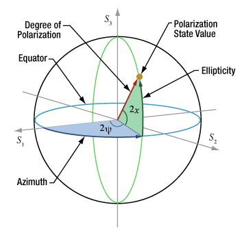

Usage
=====

.. _Stokes Vector:

Stokes Vector
------------

Birefringence is measured using Stokes vectors ``S1`` and ``S2``, corresponding to the Stokes vectors measured 
for an input polarization state modulated between states orthogonal on the
:ref:`Poincaree Sphere`, using :ref:`Spectral binning`

.. code-block:: console

   function out = PSProcess(S1,S2,procStruct)
you can find the function at PSProcess_

.. _PSProcess: https://github.com/mvWellman/PSProcessing/blob/489f6fb415022a96c237486b8d49b5905b482112/PSProcess.m

.. math:: S_p=\begin{bmatrix} I_p\\Q_p\\U_p\\V_p \end{bmatrix}

.. _Poincare Sphere:

Poincare Sphere
----------------

Below is a representation of Poincare Sphere: Thorlabs_
    
.. _Thorlabs: https://www.thorlabs.com/newgrouppage9.cfm?objectgroup_id=14200

.. _Spectral binning:

Spectral binning
----------------
.. _algorithm: https://www.ncbi.nlm.nih.gov/pmc/articles/PMC3724396/

The principle strategy behind our algorithm_ relies on the fact that the impact of Polarization mode dispersion (PMD) depends on the ratio of its magnitude with the system resolution and using a spectral window narrowed by a factor N thus allows reducing the influence of the system PMD on the polarization image.

